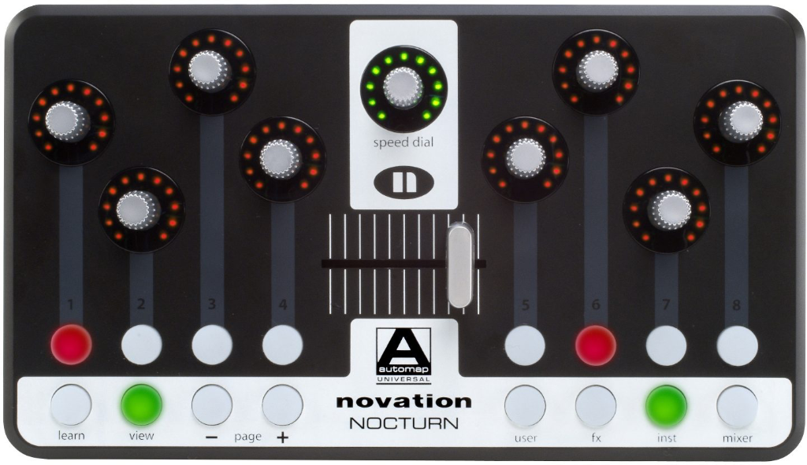
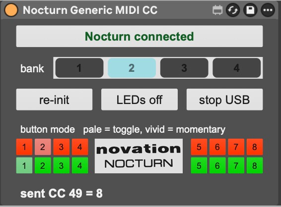

# Jinete Nocturno (Nocturn-CC): Novation Nocturn MIDI CC Liberation

> **Resurrecting the Novation Nocturn into a high-performance, class-free MIDI Control Change surface for Ableton Live and modern DAWs.**

| Physical Novation Nocturn Hardware | Ableton Live Max for Live Interface |
|:---:|:---:|
|  |  |

---

## The "Abandonhardware" Manifesto

In 2008, Novation engineered one of the most ergonomically and mechanically brilliant controllers in music technology history: the **Novation Nocturn**. 

At an accessible price point, the hardware offered specifications that remain rare even among modern flagship controllers:
* **8 continuous optical rotary encoders** with high-resolution rotational feedback.
* **Surrounding 11-segment LED ring displays** for every single encoder with multiple display modes.
* **A dedicated large center Speed Dial** with its own circular LED ring.
* **Capacitive touch sensitivity** integrated across all 8 encoders, the speed dial, and the crossfader.
* **A smooth 45 mm optical crossfader**.
* **16 backlit, tactile soft-click rubber buttons** with individual LED feedback.

Yet, Novation made a fatal architectural decision driven by proprietary vendor lock-in: **they refused to implement standard USB Audio/MIDI Class-Compliant descriptors**. Instead, the hardware was chained to Novation's proprietary "Automap" host wrapper software. 

When operating systems evolved to 64-bit architectures and Apple Silicon transitioned macOS, Novation quietly terminated Automap development, discontinued driver updates, and refused to open-source the firmware or release class-compliant descriptors. Hundreds of thousands of pristine, physically indestructible Nocturn units worldwide were instantly turned into digital paperweights—deliberately converted into **"abandonhardware"** while their owners were defrauded of a controller that had decades of operational life left in it.

**Nocturn-CC is the definitive liberation project.** Bypassing Automap entirely, it communicates directly with the low-level USB endpoint via a native 64-bit universal external (`11nocturn.mxo`), converting every physical knob, button, fader, and touch sensor into standard, bankable MIDI Control Change (CC) messages directly assignable in Ableton Live via native `Cmd + M` mapping.

---

## Key Features

* **4 Instant Hardware Banks (32 Encoders)**: Expands the physical 8 knobs into 32 fully independent MIDI CC channels (Bank 1: CC 16–23, Bank 2: CC 24–31, Bank 3: CC 32–39, Bank 4: CC 40–47) with zero latency bank-switching via a bold top tab bar.
* **Dual-Mode Button Engine**: Each of the 16 tactile buttons can be independently configured in Toggle (latching) or Momentary mode with per-button visual feedback on both the Max for Live interface and the physical hardware LEDs.
* **Fine-Resolution Shift Mode (0.5x Precision)**: Hold down the physical center Speed Dial click like a shift key to immediately drop encoder sensitivity to 0.5x resolution (two mechanical detents per MIDI CC step). A sub-unit fractional accumulator preserves micro-steps without dead zones, while the acceleration curve is cleanly bypassed for surgical parameter adjustments.
* **Hardware-Native Shift Visual Feedback**: Engaging Shift mode lights up the entire circular LED ring around the Speed Dial, providing instant tactile and visual confirmation on the controller without occupying extra screen real estate in Ableton Live.
* **Smart Button Debounce & MIDI Learn Shield**: Filters out repetitive button state bursts from the USB polling loop, ensuring Ableton Live's native `Cmd + M` MIDI Learn captures exactly what you turn or press without ghost triggers.
* **Adaptive Non-Linear Encoder Acceleration**: Faithfully replicates the tactile responsiveness of professional analog gear—slow rotational movement resolves single-step precision (1 step), while brisk whipping accelerates dynamically up to 9 steps per tick.
* **Bidirectional 11-LED Ring Display Control**: Drives the physical LED rings dynamically across all 8 encoders and the center Speed Dial, supporting Fill from Minimum, Fill from Maximum, Center Bi-directional, Center Single-direction, and Single Dot modes.
* **Full Capacitive Touch & Crossfader Integration**: Emits dedicated MIDI messages upon physical touch of the encoder caps, enabling instant channel selection, pop-up parameter focus, or secondary modulation simply by resting your fingertips on the knobs.
* **Crash-Proof One-Shot USB Teardown Guard**: Resolves the notorious `libusb_release_interface` double-free panic / `EXC_BAD_ACCESS` race condition that plagued legacy externals, ensuring rock-solid stability during Ableton Live set transitions.
* **WCAG 2.1 AAA High-Contrast UI**: Scientifically verified UI contrast ratios (13.18:1 button label contrast, 5.96:1 state indicators) ensuring flawless readability in low-light stage and studio environments.
* **Restored Retina Hardware Branding**: Features a custom high-resolution branding element meticulously vectorized and contrast-restored from original hardware macro photography.
* **Native Apple Silicon & Intel Universal Support**: Fully compatible with macOS Tahoe, Sequoia, Sonoma, Ventura, and Monterey on both `arm64` (M1/M2/M3/M4) and `x86_64` (Intel).

---

## Signal Flow Architecture

Because Max for Live devices run inside Ableton Live's internal audio/MIDI processing graph, an M4L device cannot directly register a virtual CoreMIDI input port in macOS. To achieve seamless, native `Cmd + M` mapping across any parameter, track, or third-party VST plugin in Ableton Live, `Nocturn-CC` utilizes a streamlined, loopback-free pipeline:

```
[ Novation Nocturn Hardware ]
             │ (Raw USB Endpoint: VID 0x1235 / PID 0x000a)
             ▼
[ 11nocturn.mxo External ] (Universal Mach-O arm64/x86_64)
             │ (Raw increments, button states, touch flags)
             ▼
[ nocturn_cc.js Engine ] (Banking, acceleration, toggle logic)
             │ (Pre-formatted MIDI bytes: Status, CC, Value)
             ▼
[ Live MIDI Track ] (Monitor: In / All Ins, Instrument-free)
             │ (Track Output: MIDI To)
             ▼
[ macOS IAC Driver Bus: "Nocturn" ]
             │ (System-wide Virtual CoreMIDI Stream)
             ▼
[ Ableton Live MIDI Input: Remote ON ]
             │ (Live Remote Mapping Engine)
             ▼
[ Ableton Live Parameters / VSTs via Cmd + M ]
```

---

## Installation & Setup Guide

### Step 1: Create the macOS IAC Virtual MIDI Bus

Ableton Live's native `Cmd + M` mapping engine listens exclusively to inputs recognized as **Remote** MIDI Input Ports. Creating a persistent virtual bus in macOS takes 30 seconds:

1. Open `/Applications/Utilities/Audio MIDI Setup.app`.
2. Select **Window > Show MIDI Studio** from the menu bar.
3. Double-click the red **IAC Driver** icon.
4. Check the box **Device is online**.
5. Under the **Ports** table, select the existing port (or click `+`) and rename it to:
   ```
   Nocturn
   ```
6. Click **Apply** and close Audio MIDI Setup.

---

### Step 2: Configure Ableton Live Preferences

1. Open **Ableton Live** and navigate to **Settings / Preferences (`Cmd + ,`) > Link, Tempo & MIDI**.
2. Scroll to the **MIDI Ports** table and configure the **IAC Driver (Nocturn)** ports as follows:

| Port | Track | Sync | Remote |
|---|:---:|:---:|:---:|
| **Input: IAC Driver (Nocturn)** | Off | Off | **ON** |
| **Output: IAC Driver (Nocturn)** | **ON** | Off | Off |

> [!WARNING]
> Do NOT enable `Track` on the **Input: IAC Driver (Nocturn)** port. Enabling `Track` on input creates a feedback loop into active recording tracks.

---

### Step 3: Setup the Dedicated Nocturn Host Track

1. Create a new empty **MIDI Track** in your Ableton Live set and name it `Nocturn Host`.
2. Ensure the **In/Out** mixer section is visible (**View > In/Out** or `Cmd + Option + I`).
3. Set track routing:
   * **MIDI From**: `All Ins` (or `No Input`).
   * **Monitor**: `In` (or `Auto`).
   * **MIDI To**: Select `IAC Driver (Nocturn)` -> `Channel 1`.
4. Drag and drop `Jinete Nocturno.amxd` onto this track.
5. Keep this track completely free of audio instruments, synths, or audio effects. *(Loading an instrument transforms the output selector to `Audio To`, hiding the MIDI bus).*

---

### Step 4: Map Parameters Instantly

1. Connect your Novation Nocturn via USB.
2. Press **`Cmd + M`** in Ableton Live to enter MIDI Map Mode.
3. Click any knob, slider, filter cutoff, or plugin parameter on your screen.
4. Turn the desired encoder on the Nocturn. Live will map it instantly!
5. Press **`Cmd + M`** again to exit mapping mode.

---

## Hardware Operation & The Golden Rules

### Hardware Initialization
The Novation Nocturn possesses no physical power switch. Upon USB connection, its microcontroller remains unpowered in a dormant state (LEDs completely off) until the host sends the low-level `state 1` USB command.
* `Nocturn-CC` automatically sends a single initialization command 1.0 second after loading.
* If you connect the USB cable while Live is already running, simply click the **`re-init`** button on the device face.

### The Single-Instance Rule
The underlying `11nocturn.mxo` external claims exclusive access to the USB device interface (`libusb_claim_interface`). **Never load two instances of this device simultaneously in the same Ableton set.** Doing so creates a USB claiming race condition that will crash Ableton Live.

### Safe Deletion Procedure
To safely remove or replace the device from a track without triggering a driver hang:
1. Save your set (`Cmd + S`).
2. Click the **`stop USB`** button on the device interface.
3. Wait 2 seconds for the USB worker thread to exit cleanly.
4. Delete the device from the track.

---

## MIDI Implementation Chart

### Rotary Encoders (Continuous CC)
The 8 physical rotary encoders map to 32 distinct MIDI CC addresses across 4 switchable banks:

| Encoder | Bank 1 | Bank 2 | Bank 3 | Bank 4 |
|:---:|:---:|:---:|:---:|:---:|
| **Enc 1** | CC 16 | CC 24 | CC 32 | CC 40 |
| **Enc 2** | CC 17 | CC 25 | CC 33 | CC 41 |
| **Enc 3** | CC 18 | CC 26 | CC 34 | CC 42 |
| **Enc 4** | CC 19 | CC 27 | CC 35 | CC 43 |
| **Enc 5** | CC 20 | CC 28 | CC 36 | CC 44 |
| **Enc 6** | CC 21 | CC 29 | CC 37 | CC 45 |
| **Enc 7** | CC 22 | CC 30 | CC 38 | CC 46 |
| **Enc 8** | CC 23 | CC 31 | CC 39 | CC 47 |

### Master Controls & Navigation
| Control | MIDI Type | Address | Range / Behavior |
|---|:---:|:---:|---|
| **Speed Dial** | CC | CC 60 | Continuous 0–127 |
| **Crossfader** | CC | CC 64 | Continuous 0–127 (45 mm optical) |
| **Top Buttons (1–8)** | CC | CC 70–77 | 0 / 127 (Toggle or Momentary) |
| **Bottom Buttons (9–16)** | CC | CC 78–85 | 0 / 127 (Toggle or Momentary) |
| **Touch Sensors (Enc 1–8)** | Note On/Off | Notes 48–55 | Velocity 127 on touch, 0 on release |
| **Speed Dial Touch** | Note On/Off | Note 56 | Velocity 127 on touch, 0 on release |
| **Crossfader Touch** | Note On/Off | Note 57 | Velocity 127 on touch, 0 on release |

---

## Repository Structure

```
Nocturn-CC/
├── Jinete Nocturno.amxd   # Ready-to-use production Max for Live device
├── 11nocturn.mxo/                 # Universal Mach-O 64-bit USB driver (arm64 & x86_64)
├── nocturn_cc.js                  # Core JavaScript banking, acceleration & mapping engine
├── nocturn_settings.json          # Persistent hardware configuration template
├── build_amxd.py                  # Standalone headless compiler for .amxd patch generation
├── assets/                        # High-resolution retina branding & hardware assets
│   ├── hardware.png               # Physical hardware reference photograph
│   ├── device_ui.png              # Ableton Live Max for Live device interface
│   ├── nocturn_logo.png           # Restored Retina vector branding
│   └── cells_preview.png          # High-contrast button matrix preview
├── tools/                         # Automated validation & engineering test harness
│   ├── wcag.py                    # WCAG 2.1 contrast ratio verification suite
│   ├── midimon.swift              # Low-level Swift CoreMIDI packet monitor
│   └── midisend.swift             # Automated MIDI stress-testing harness
├── LICENSE                        # GNU General Public License v3.0
└── README.md                      # Comprehensive documentation and setup guide
```

---

## Compiling from Source

`Nocturn-CC` includes a fully reproducible, headless Python build tool (`build_amxd.py`) that generates the binary `.amxd` file directly from raw Max JSON representations without requiring the Max graphical editor:

```zsh
# Rebuild the AMXD device using the factory Max MIDI Effect template
python3 build_amxd.py \
  "/Applications/Ableton Live 12 Suite.app/Contents/App-Resources/Misc/Max Devices/Max MIDI Effect.amxd" \
  "Jinete Nocturno.amxd"
```

---

## Accessibility Verification

All interface colors on the device face have been verified against the **W3C WCAG 2.1** color contrast specifications using `tools/wcag.py`:

| Interface Component | Background | Foreground | Measured Ratio | WCAG Compliance |
|---|---|---|:---:|:---:|
| **Button Text** | `#CCCCCC` | `#1A1A1A` | **13.18:1** | **Passes AAA** |
| **Active Bank Tab** | `#5F97D6` | `#1A1A1A` | **5.71:1** | **Passes AA** |
| **Hardware Connected LED** | `#CCCCCC` | `#0F5F23` | **5.93:1** | **Passes AA** |
| **Hardware Disconnected LED**| `#CCCCCC` | `#A31414` | **5.96:1** | **Passes AA** |
| **Button Matrix (Toggle)** | `#CCCCCC` | `#6FCB80` | **8.73:1** | **Passes AAA** |
| **Button Matrix (Momentary)** | `#CCCCCC` | `#00D400` | **8.63:1** | **Passes AAA** |

---

## Credits & Acknowledgments

* **Low-Level USB Driver & Reverse-Engineering**: Authored by **[@11ols](https://github.com/11ols)** ([11OLSEN.DE](https://11olsen.de)), upstream repository: [11ols/11nocturn](https://github.com/11ols/11nocturn) under the GNU General Public License.
* **Max for Live Architecture, Modernization & Release**: Developed by **Profitsarts & Claude Code** (2026).
* **License**: Released under the [GNU General Public License v3.0](LICENSE). Free for musicians, producers, and developers worldwide.
